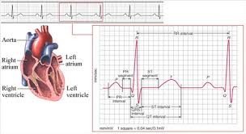

# Biosignal Dataset

안녕하세요. **생체신호 데이터셋 노션 페이지**에 오신 것을 환영합니다.

!!! note ""
    💡 자연어 처리 (Natural Language Processing, NLP)과 컴퓨터 비전(Computer Vision, CV) 분야에서는 다양한 연구를 뒷받침하는 대규모 공개 데이터셋이 이미 잘 구축되어 있습니다. 특히 최근에는 파운데이션 모델 개발이 활발해지면서, 대규모 데이터셋의 중요성이 더욱 부각되고 있습니다. 반면, 생체신호(Biosignal) 분야에서는 아직까지 대규모 데이터셋을 확보하기가 쉽지 않은 상황입니다. 이에 따라 최근의 연구들은 하나의 대규모 데이터셋에 집중하거나, 여러 개의 데이터셋을 통합하여 활용하는 방식을 채택하고 있습니다. 그러나 여러 데이터셋을 수집하고 그 구조와 특성을 이해하는 과정은 많은 시간과 노력이 필요하며, 특히 생체신호 연구를 처음 접하시는 연구자분들께는 진입 장벽이 매우 높을 수 있습니다.
    이러한 문제를 해소하고자, 본 페이지에서는 생체신호 유형별 기본 개요와 최신 연구 동향, 전처리 방식, 그리고 데이터셋별 상세 정보에 이르기까지 폭넓은 자료를 제공해 드리고자 합니다. 이를 통해 연구자분들께 생체신호 데이터셋을 보다 쉽고 효율적으로 탐색하고 활용하실 수 있도록 돕는 것을 목표로 하고 있습니다.
    
    본 페이지에서 다루는 생체신호 데이터셋은 다음 세 가지를 포함합니다:
    
    - **심전도 (ECG):** [🫀 ECG DATASET](ecg/)
    - **뇌파 (EEG):** [🧠 EEG DATASET](eeg/)
    - **근전도 (EMG):** [💪🏻 EMG DATASET](emg/)

# [🧠 EEG DATASET](eeg/)

---

> 최근 생체 신호 기반 헬스케어 기술이 빠르게 발전함에 따라, 뇌전도(EEG, Electroencephalogram)를 활용한 인공지능(AI) 연구 또한 활발히 진행되고 있습니다. EEG는 뇌의 전기적 활동을 비침습적으로 측정할 수 있는 대표적인 생체 신호로, 신경과학 및 임상 진단, 뇌-컴퓨터 인터페이스(BCI), 수면 분석, 정신질환 감지 등 다양한 분야에서 폭넓게 활용되고 있습니다. 특히, 다채널 EEG 데이터를 대규모로 수집하고 이를 정밀하게 분석함으로써, 인간의 인지 상태 추정이나 뇌 질환의 조기 진단이 가능해지고 있으며, 이러한 데이터를 기반으로 한 AI 기반 예측 및 진단 시스템의 실현 가능성 또한 점차 높아지고 있습니다.
> 
> 
> 그러나 EEG 데이터의 특성과 AI 모델의 적용 과정에는 여러 기술적인 도전 과제가 존재합니다. 우선, 고품질의 라벨링이 완료된 EEG 데이터를 수집하고 주석을 다는 과정에는 막대한 시간과 비용이 소요되며, 이로 인해 학습에 필요한 충분한 양의 데이터를 확보하는 데 어려움이 따릅니다. 또한, EEG 신호는 신호 대 잡음비(SNR)가 낮고, 근전도(EMG), 안구 운동(EOG), 전극 접촉 등 다양한 아티팩트(artifact)에 매우 민감하다는 한계를 지닙니다. 더불어, EEG는 개인차가 매우 크고 시간에 따라 동적인 변화를 보이기 때문에, 특정 조건에서 훈련된 모델을 다른 조건에 일반화하기 어렵습니다. 이러한 요소들은 EEG 기반 AI 시스템의 신뢰성과 임상 적용 가능성을 제한하는 주요 요인으로 작용하고 있습니다.
> 
> 이러한 배경 속에서, 다양한 조건과 주석 정보를 갖춘 고품질 EEG 데이터셋에 대한 수요가 지속적으로 증가하고 있습니다. 예를 들어, Temple University Hospital EEG Corpus(TUH EEG)는 발작 감지 및 분류를 위한 대규모 임상 EEG 데이터셋으로서, 풍부한 라벨 정보를 제공하며 여러 고성능 AI 모델 개발에 널리 활용되고 있습니다. 또한, 최근에는 파운데이션 모델 개발을 위한 더 큰 규모의 EEG 데이터셋에 대한 수요가 커짐에 따라, 여러 공개 데이터셋을 통합하여 대규모 데이터셋으로 활용하려는 접근 방식도 활발히 시도되고 있습니다. 그러나 이러한 방식은 각 데이터셋의 구조와 특성을 이해하고, 수집 및 정제하여 활용하기까지 많은 시간과 노력이 요구됩니다. 이에 본 백서에서는 다양한 EEG 데이터셋을 보다 효율적으로 활용하실 수 있도록, 각 데이터셋에 대한 기반 정보와 체계적인 정리를 제공하고자 합니다.
> 
> 본 백서에서는 EEG 데이터셋의 기술적 개요, 채널 구성과 수집 조건, 신호의 특성과 라벨링 방식 등을 정리하였으며, 대표적인 공개 데이터셋들의 비교와 실제 활용 사례, 그리고 전이 학습, few-shot 학습 등 최신 AI 기법을 적용한 연구 동향을 종합적으로 소개해 드립니다. 아울러 발작 탐지, 감정 인식, 운동 상상 등 16가지 주요 다운스트림 테스크별로 적합한 EEG 데이터셋과 그 활용 방안에 대해서도 함께 제시하고 있습니다.
> 
> [EEG Dataset](eeg/)
> 
> [EEG Dataset (1)](eeg/eeg-dataset-2/)
> 

](images/image.png)

# [🫀 ECG DATASET](ecg/)

---

> 최근 센서 기술의 발전과 디지털 헬스케어 솔루션의 확산으로 인해 다양한 생체전기신호 데이터를 대규모로 수집할 수 있게 되었습니다. 특히, 심전도(ECG) 신호는 심혈관 질환의 진단과 관리에서 핵심적인 역할을 하며, 임상 환경에서 기록된 표준 12‑리드 ECG 데이터는 심장 질환을 조기에 발견하고 정확하게 진단하는 데 중요한 정보를 제공합니다. 이를 기반으로 개발된 인공지능(AI) 알고리즘은 환자 모니터링 및 치료 결정 지원에 혁신적인 기여를 하고 있습니다.

 그러나 생체전기신호를 활용한 AI 연구에서는 여러 가지 공통적인 도전 과제가 존재합니다. 첫째, 고품질 라벨링이 적용된 ECG 데이터셋을 확보하는 데 많은 비용과 시간이 소요되므로 라벨 데이터의 부족 문제가 심각합니다. 둘째, 센서 한계, 환경 요인, 개인의 생리적 차이 등으로 인해 ECG 신호는 본질적으로 잡음이 많고 신호 대 잡음비가 낮으며, 높은 변동성을 보입니다. 셋째, 특정 임상 환경에서 수집된 데이터를 기반으로 학습된 모델은 다른 환경이나 피실험자 집단에 대해 일반화하는 데 한계를 가집니다. 이러한 문제는 신뢰할 수 있는 AI 진단 시스템의 개발과 상용화에 있어 큰 장애 요소로 작용합니다.

이러한 배경에서 고품질 ECG 데이터셋의 중요성이 더욱 부각되고 있습니다. 예를 들어, PTB‑XL 데이터셋은 18,869명의 환자로부터 총 21,799개의 임상 기록을 포함하고 있으며, 각 기록은 10초 길이의 12‑리드 신호와 최대 71개의 표준화된 임상 주석을 제공합니다. 이를 활용한 연구에서는 심근경색, 부정맥, 전도 이상, 심장 비대 등 다양한 심장 질환에 대한 자동 분류 및 진단 알고리즘이 개발되었으며, 실제 임상 환경에서 빠르고 정확한 의사결정 지원 시스템으로 발전하고 있습니다.

또한, 최근 비대면 진료 및 원격 모니터링의 필요성이 증가함에 따라, 원격 ECG 모니터링 시스템이 활발히 연구되고 있습니다. 일부 의료기관에서는 이상치 탐지 기반의 알고리즘을 적용하여 환자의 심장 이상 징후를 실시간으로 감지하고, 비대면 재진 진료 시 신속한 대응을 가능하게 하고 있습니다. 정부와 관계 부처에서도 디지털 치료기기 및 AI 의료기기에 대한 보험 적용 가이드라인을 마련하는 등, 고품질 ECG 데이터셋을 활용한 연구의 사회적·경제적 파급 효과가 매우 크다는 점이 입증되고 있습니다.

본 백서는 AI 연구자, 임상의, 의료기기 개발자 등 심전도 데이터를 활용하여 혁신적인 진단 및 모니터링 솔루션을 개발하고자 하는 전문가를 대상으로 합니다. ECG 데이터셋의 상세 개요, 데이터 구성 및 특성을 설명하고, 실제 활용 사례와 시각화 자료를 제공하며, 전이 학습 및 Few‑Shot 학습 등 최신 기술 적용 사례를 종합적으로 소개합니다.
> 

[ECG Dataset](ecg/)

# 💪🏻 EMG DATASET

---

> 헬스케어시스템의 발전으로 다양한 생체전기신호 분석에 대한 관심이 증가하면서, 생체전기신호 분석에도 다양한 연구들이 수행되고 있다. 그 중 사람의 근육 움직임을 반영하는 생체전기신호인 Electromyogram (EMG)는 질병진단 [^1][^2][^3], 감정분석 [^4][^5][^6], 재활 [^7][^8][^9], 최근에는 사람과 기계 혹은 컴퓨터간 소통(Human Machine Interface; HMI, Human Computer Interface; HCI)과 관련된 분야에 활용되고 있다 [^10][^11][^12]. 또한, AI (Artificial Intelligence) 기술의 적극적인 도입으로, 이전에는 EMG에서 분석할 수 없었던 정보들을 얻게 되면서 각 분야의 큰 발전을 이끌어내고 있다. 이러한 AI 모델들은 데이터셋을 기반으로 개발되는데, 이는 좋은 데이터셋의 확보가 좋은 AI 모델로 이어지는 것을 나타낸다. 특히, 최근에는 의료 파운데이션 모델에 대한 연구들이 주목받으면서, 생체전기신호 데이터셋의 확보 중요도는 더욱이 높아지고 있다.
> 
> 
> 하지만, AI 기술이 발전되면서 데이터셋의 중요도가 강조되고 있음에도, 다양한 EMG 데이터셋의 확보가 어려운 한계점이 있다. Ninapro의 경우 [^13][^14][^15], 손동작 및 손가락 움직임과 관련된 데이터셋을 홈페이지를 통해 공개 및 각 정보들을 자세하게 소개해두고 있지만, 대부분의 연구에서는 데이터셋을 공개하고 있지 않고 있다. 이는 하나의 AI 기반 모델을 개발한 후 다양한 케이스에 대해 교차검증하기 어려운 한계점과, 다양한 케이스를 학습시켜보지 못한다는 한계점을 또한 같이 보여준다.
> 
> 본 백서에서는 이전 연구들에서 지적하고 있는 한계점들을 해결하기 위해, 여러 오픈 소스 데이터셋을 한 곳에 모으고, 각각의 정보와 전처리 방법 그리고 각 데이터셋을 활용할 수 있는 방안들을 같이 제안하고자 한다. 본 백서가 EMG를 활용한 연구를 수행하고자 하는 연구자들에게 하나의 가이드라인로써 기여할 것으로 기대한다.
> 
> [EMG dataset](emg/)
> 

